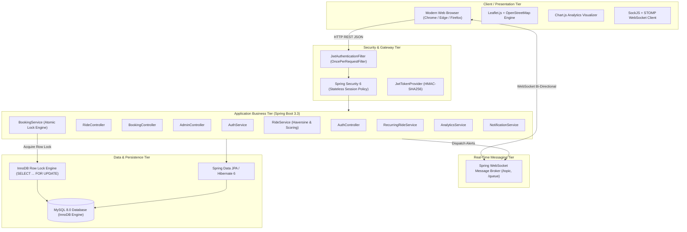

# 02. System Architecture & Tech Stack Rationale

---

## 🏛️ High-Level System Architecture

---

## 🛠️ Technology Stack & Engineering Rationale

When an interviewer asks: *"Why did you choose this specific tech stack over alternatives?"*, use these points:

### 1. Java 21 & Spring Boot 3.3
- **Why I chose it**: Java 21 brings modern language ergonomics (records, pattern matching, enhanced switch expressions) alongside top-tier garbage collectors (ZGC, G1) and virtual thread readiness. Spring Boot 3.3 provides a rock-solid, production-grade ecosystem with native Jakarta EE 10 standards, unified metrics, and streamlined transaction management.
- **Alternative considered**: Node.js / Express.
  - *Why Java won*: Java provides compile-time type safety, structured multithreading abstractions (`CountDownLatch`, `ExecutorService`), and seamless declarative database transactions (`@Transactional`), which were crucial for preventing seat overbooking.

### 2. MySQL 8.0 with InnoDB Storage Engine
- **Why I chose it**: MySQL 8 is a proven ACID-compliant relational database. The **InnoDB engine** provides row-level locking (`SELECT ... FOR UPDATE`), MVCC (Multi-Version Concurrency Control), and strict foreign-key integrity constraints.
- **Alternative considered**: MongoDB (NoSQL).
  - *Why MySQL won*: Ride sharing is intrinsically relational: Drivers have Rides, Rides have Bookings, Bookings have Passengers, and Ratings link Passengers to Drivers. Modeling this in MongoDB would lead to denormalized duplicates, risking state inconsistency during concurrent cancellations or seat decrements.

### 3. Spring Data JPA & Hibernate 6
- **Why I chose it**: Automates repository boilerplate while allowing precise control over database locking modes (`LockModeType.PESSIMISTIC_WRITE`). Hibernate handles dirty checking, transaction propagation, and relationship cascades smoothly.

### 4. Spring Security & Stateless JWT (JSON Web Tokens)
- **Why I chose it**: JWT enables a completely stateless authentication architecture. The server verifies tokens cryptographically using a 256-bit HMAC secret without needing a server-side session store or database lookup on every request, providing high throughput.
- **Password Security**: Passwords are never stored in plain text; they are hashed using `BCryptPasswordEncoder` with a default cost factor of 10.

### 5. Spring WebSocket with STOMP Protocol
- **Why I chose it**: STOMP (Simple Text Oriented Messaging Protocol) establishes a publish-subscribe message broker pattern over persistent WebSocket connections.
- **Alternative considered**: Short Polling or Long Polling.
  - *Why STOMP won*: Polling every 2 seconds from hundreds of active clients consumes massive HTTP overhead, server CPU, and battery. STOMP pushes booking acceptances and trip cancellations in under 50ms with zero polling overhead.

### 6. Leaflet.js & OpenStreetMap
- **Why I chose it**: A lightweight (~38 KB), mobile-friendly, open-source mapping library. It maps coordinates, custom carpool markers, and route polylines without costly Google Maps API billing or key quotas.

---

## ⚖️ Architectural Trade-Offs

### Monolith vs. Microservices
- **My Decision**: I designed ShareMile as a **Modular Monolith** rather than distributed microservices.
- **Interview Talking Point**:
  > *"For the current scale, a modular monolith was the optimal engineering decision. It eliminates distributed transaction complexity (like 2-Phase Commit or Saga patterns), avoids network serialization latencies, and simplifies ACID seat locking. Because I maintained clean domain boundaries between Auth, Rides, Bookings, and Notifications, this architecture can be cleanly broken down into independent microservices if traffic exceeds horizontal monolithic limits."*
