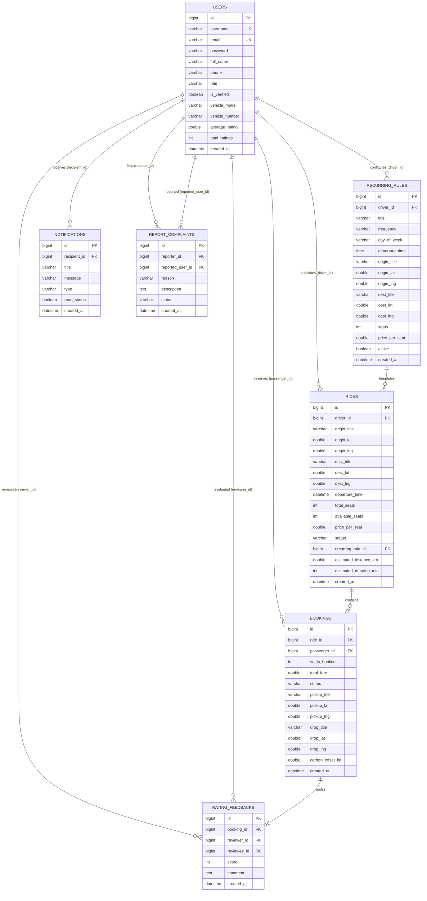

# 03. Database Design, Schema & ACID Implementation

---

## 🗄️ Entity-Relationship (ER) Diagram



---

## 📋 Table Schema Breakdown

### 1. `users` Table
- **Primary Key**: `id` (Auto-increment BigInt)
- **Unique Indexes**: `username` (50 chars), `email` (100 chars)
- **Key Columns**:
  - `role`: Holds user authority (`ROLE_PASSENGER`, `ROLE_DRIVER`, `ROLE_ADMIN`).
  - `average_rating`: Float/double updated incrementally upon rating submission.
  - `is_verified`: Boolean flag managed by administrator moderation.

### 2. `rides` Table
- **Primary Key**: `id` (Auto-increment BigInt)
- **Foreign Keys**: `driver_id` referencing `users(id)`, `recurring_rule_id` referencing `recurring_rules(id)`.
- **Critical Concurrency Column**: `available_seats`. This integer column is protected by row-level locking.
- **Status Lifecycle**: `SCHEDULED` ➔ `ONGOING` ➔ `COMPLETED` (or `CANCELLED`).

### 3. `bookings` Table
- **Foreign Keys**: `ride_id` referencing `rides(id)`, `passenger_id` referencing `users(id)`.
- **State Transition Machine**:
  ```text
  [Passenger Requests] ➔ PENDING
         ├── [Driver Confirms] ➔ ACCEPTED (Locks seats confirmed)
         ├── [Driver Declines] ➔ REJECTED (Releases reserved seats back to ride)
         └── [User Cancels]    ➔ CANCELLED (Replenishes seats back to ride)
  ```
- **Environmental Tracking**: `carbon_offset_kg` computed at time of booking creation.

---

## 🔒 ACID Principles in ShareMile

When an interviewer asks: *"How did you ensure ACID compliance in your database operations?"*

### A — Atomicity (All-or-Nothing)
- **Problem**: When reserving a seat, two distinct updates occur: (1) decrement `available_seats` in `rides`, and (2) insert a new record into `bookings`. If the booking insert fails due to a network glitch or constraint violation, the seats must not remain decremented.
- **My Solution**: Wrapped inside Spring Boot's `@Transactional`. If any runtime exception triggers, Spring's `TransactionInterceptor` automatically commands the database connection to issue a `ROLLBACK`, reverting all modifications to their initial state.

### C — Consistency (Valid State Only)
- **Problem**: Preventing impossible business states (e.g., negative seats `available_seats < 0` or a driver booking their own carpool).
- **My Solution**: Business validations combined with SQL constraints:
  ```java
  if (ride.getAvailableSeats() < seatsRequested) {
      throw new IllegalStateException("Insufficient seat capacity!");
  }
  ```

### I — Isolation (No Dirty or Concurrent Overwrites)
- **Problem**: **Race conditions**. Two passengers read `available_seats = 1` simultaneously. Both check `1 >= 1` (true), both decrement to 0, and both create a booking. Total bookings = 2, actual capacity = 1 (Overbooking bug!).
- **My Solution**: I configured transaction isolation to `READ_COMMITTED` and executed:
  ```java
  @Lock(LockModeType.PESSIMISTIC_WRITE)
  @Query("SELECT r FROM Ride r WHERE r.id = :id")
  Optional<Ride> findByIdWithLock(@Param("id") Long id);
  ```
  In MySQL InnoDB, this issues `SELECT * FROM rides WHERE id = ? FOR UPDATE`. The first transaction acquires an exclusive row lock; subsequent transactions are forced to wait until the lock is released or encounter the updated state.

### D — Durability (Persistent Recovery)
- **My Solution**: MySQL InnoDB uses write-ahead logging (**redo log**). Once a transaction commits, data is guaranteed to survive server crashes or sudden power losses.

---

## ⚡ Indexing & Performance Strategy

1. **Foreign Key Indexes**: MySQL InnoDB automatically creates B-tree indexes on foreign key columns (`driver_id`, `passenger_id`, `ride_id`).
2. **Composite Index on Rides**:
   ```sql
   CREATE INDEX idx_rides_status_time ON rides (status, departure_time);
   ```
   Ensures queries fetching active scheduled carpools perform fast B-Tree index range scans rather than full table scans.
3. **Spatial Considerations**: For high-scale spatial coordinate lookups, coordinates can be indexed via MySQL 8.0 `POINT` spatial data types with `SPATIAL INDEX` using R-Tree algorithms.
