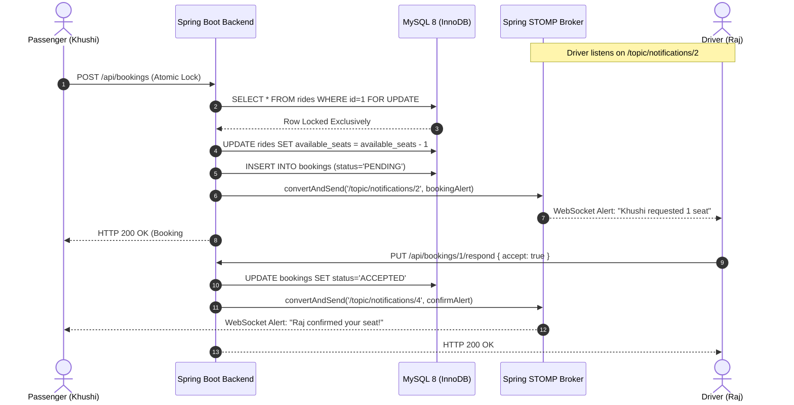

# 05. REST API Specifications & WebSocket Event Flow

---

## 📡 REST API Catalog

All endpoints (except `/api/auth/**`) require an HTTP `Authorization: Bearer <JWT_TOKEN>` header.

### 1. Authentication & Users
| Method | Endpoint | Access Role | Description |
|---|---|---|---|
| `POST` | `/api/auth/register` | Public | Register a new passenger or driver account |
| `POST` | `/api/auth/login` | Public | Authenticate credentials and receive JWT |
| `GET` | `/api/auth/me` | Authenticated | Retrieve current user profile and role details |

### 2. Rides Management & Spatial Search
| Method | Endpoint | Access Role | Description |
|---|---|---|---|
| `POST` | `/api/rides` | `ROLE_DRIVER` | Publish a new carpool with coordinates, seats, and price |
| `POST` | `/api/rides/search` | Authenticated | Run Haversine spatial filter and match score ranking |
| `GET` | `/api/rides/{id}` | Authenticated | Fetch specific ride details and driver info |
| `GET` | `/api/rides/my-published` | `ROLE_DRIVER` | List all carpools published by current driver |
| `PUT` | `/api/rides/{id}/status` | `ROLE_DRIVER` | Transition ride state (`SCHEDULED`, `ONGOING`, `COMPLETED`, `CANCELLED`) |

### 3. Bookings & Atomic Seat Allocations
| Method | Endpoint | Access Role | Description |
|---|---|---|---|
| `POST` | `/api/bookings` | `ROLE_PASSENGER` | Atomically reserve seats using pessimistic row locking |
| `PUT` | `/api/bookings/{id}/respond` | `ROLE_DRIVER` | Accept or reject a pending passenger booking request |
| `PUT` | `/api/bookings/{id}/cancel` | Passenger / Driver | Cancel an active booking and replenish seat capacity |
| `GET` | `/api/bookings/my-bookings` | `ROLE_PASSENGER` | List passenger's active and historical reservations |
| `GET` | `/api/bookings/driver-requests` | `ROLE_DRIVER` | List incoming seat requests awaiting driver confirmation |

### 4. Recurring Commute Rules
| Method | Endpoint | Access Role | Description |
|---|---|---|---|
| `POST` | `/api/recurring` | `ROLE_DRIVER` | Create a recurring commute rule template (Daily / Weekdays) |
| `GET` | `/api/recurring` | `ROLE_DRIVER` | List driver's active recurring schedule templates |
| `POST` | `/api/recurring/{id}/generate`| `ROLE_DRIVER` | Generate upcoming concrete rides for N days ahead |

### 5. Ratings & Reputation
| Method | Endpoint | Access Role | Description |
|---|---|---|---|
| `POST` | `/api/ratings` | Authenticated | Submit post-trip 1-5 star rating and comment |
| `GET` | `/api/ratings/user/{id}` | Authenticated | Retrieve all reviews received by a driver or passenger |

### 6. Notifications & Real-Time Alerts
| Method | Endpoint | Access Role | Description |
|---|---|---|---|
| `GET` | `/api/notifications` | Authenticated | Fetch persistent in-app notifications history |
| `GET` | `/api/notifications/unread-count`| Authenticated | Get count of unread notifications |
| `PUT` | `/api/notifications/{id}/read`| Authenticated | Mark an individual alert as read |

### 7. Administrative Moderation & Analytics
| Method | Endpoint | Access Role | Description |
|---|---|---|---|
| `GET` | `/api/admin/analytics` | `ROLE_ADMIN` / User | Retrieve aggregated city mobility metrics & CO₂ savings |
| `GET` | `/api/admin/users` | `ROLE_ADMIN` | List all registered users with verification status |
| `PUT` | `/api/admin/users/{id}/verify`| `ROLE_ADMIN` | Toggle driver identity verification badge |
| `GET` | `/api/admin/complaints` | `ROLE_ADMIN` | List reported passenger/driver disputes |
| `POST` | `/api/admin/complaints` | Authenticated | File a report against an abusive user |
| `PUT` | `/api/admin/complaints/{id}/status`| `ROLE_ADMIN` | Update complaint status (`RESOLVED`, `DISMISSED`) |

---

## ⚡ WebSocket (STOMP) Real-Time Architecture

### Connection Handshake
1. Client initiates SockJS connection: `http://localhost:8080/ws`
2. Client upgrades to STOMP protocol:
   ```javascript
   const socket = new SockJS('/ws');
   const stompClient = Stomp.over(socket);
   stompClient.connect({}, () => {
       stompClient.subscribe(`/topic/notifications/${currentUserId}`, (msg) => {
           const alert = JSON.parse(msg.body);
           showInAppNotification(alert);
       });
   });
   ```

### Real-Time Handshake Sequence Diagram


