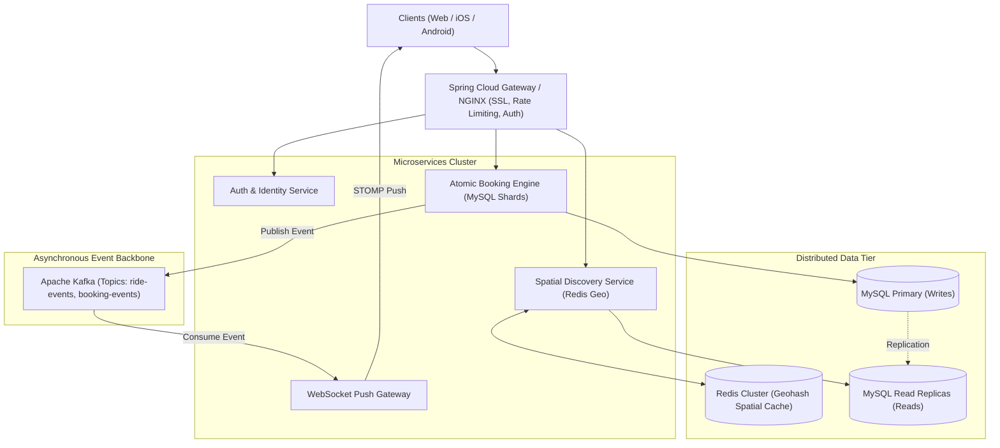

# 08. Future Roadmap & Scalability Strategy

---

## 🚀 High-Scale Target Architecture (1M+ Users)

---

## 📈 Key Scalability Pillars

### 1. Redis Geospatial Indexing (`GEOSEARCH` / `GEORADIUS`)
- Instead of computing the Haversine trigonometric formula in Java across in-memory lists of rides, active ride origins are stored in Redis using `GEOADD rides:active <lng> <lat> <ride_id>`.
- Spatial radius searches execute in **sub-millisecond time ($O(N + \log M)$)** directly in RAM.

### 2. OSRM (Open Source Routing Machine) Dynamic Detour Matching
- In Phase 1, ShareMile calculates great-circle distance between pickup and driver origin.
- In Phase 2, integrate **OSRM API** to project the driver's exact road polyline (waypoints). If a passenger's pickup is within 500 meters of any highway point along the driver's actual driving path, the ride is matched even if the origin is far away!

### 3. Asynchronous Decoupling via Apache Kafka
- When a passenger completes a booking, the HTTP thread does not wait for email, SMS, or push notifications.
- The booking engine publishes a `BookingCreatedEvent` to Kafka. Dedicated consumer workers handle driver SMS, push alerts, and audit analytics independently.

### 4. Real-World Payment Gateway & Escrow
- Integration with UPI (Unified Payments Interface) via Razorpay or Stripe.
- Fare is held in platform escrow when the booking is confirmed and released to the driver only after the ride state transitions to `COMPLETED`.
